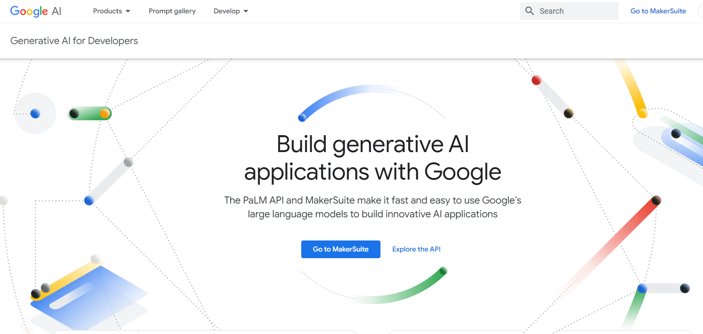

# GenerativeAI_with_PALM
GenerativeAI_with_PALM : https://developers.generativeai.google/products/palm

|                                  |
| ------------------------------------------------------------ |
| **Examples:**                                                |
| **1. Anomaly Detection:**  |
| **2. Chat Calculator:**  |
| **3. Clustering with Embedding:**  |
| **4. Doc Search Embedding:** |
| **5. Text Calculator:**  |
| **6. Train Text Classification Embedding:**  |
| **7.  VectorDB with Chroma:**  |

